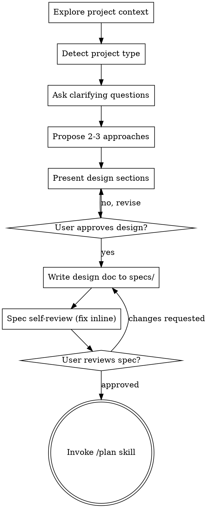

# Brainstorming Ideas Into Designs

Help turn ideas into fully formed designs and specs through natural collaborative dialogue, then transition cleanly to `/plan` for implementation planning.

Start by understanding the current project context, then ask questions **one at a time** to refine the idea. Once you understand what you're building, present the design and get user approval.

<HARD-GATE>
Do NOT invoke any implementation skill, write any code, scaffold any project, or take any implementation action until you have presented a design AND the user has approved it. This applies to EVERY project regardless of perceived simplicity — including "just a quick WP plugin tweak" or "just a small React component".
</HARD-GATE>

## Anti-Pattern: "This Is Too Simple To Need A Design"

Every project goes through this process. A tiny WP filter hook, a single Gutenberg block, a WooCommerce tweak, a config change — all of them. "Simple" projects are where unexamined assumptions cause the most wasted work. The design can be short (a few sentences for truly simple projects), but you MUST present it and get approval.

## Checklist

You MUST create a task for each of these items (use TaskCreate) and complete them in order:

1. **Explore project context** — check files, `CLAUDE.md`, `.claude/rules/`, recent commits, `composer.json` / `package.json`, `plugin.json` for WP plugins
2. **Detect project type** — WP Plugin / WP Theme / Block Theme / React App / Node.js backend / mixed. Optionally delegate to `/wp-project-triage` if it's a WordPress repo.
3. **Ask clarifying questions** — one at a time, understand purpose / constraints / success criteria
4. **Propose 2-3 approaches** — with trade-offs and your recommendation
5. **Present design** — in sections scaled to their complexity, get user approval after each section
6. **Write design doc** — save to `specs/YYYY-MM-DD-<topic>-design.md` and commit
7. **Spec self-review** — quick inline check for placeholders, contradictions, ambiguity, scope
8. **User reviews written spec** — ask user to review the spec file before proceeding
9. **Transition to `/plan`** — invoke the `/plan` skill to create implementation plan (NOT direct implementation)

## Process Flow

**The terminal state is invoking `/plan`.** Do NOT invoke `/wp-plugin-development`, `/wp-block-development`, `/react-master`, or any implementation skill directly from here. The ONLY skill you invoke after brainstorming is `/plan`.

## The Process

### Understanding the idea

- Check the current project state first: files, `CLAUDE.md`, `.claude/rules/`, recent commits, specs/ directory
- Detect project type; for WordPress projects, optionally delegate `/wp-project-triage` to get a structured read
- **Scope assessment first:** If the request describes multiple independent subsystems (e.g., "build a WooCommerce plugin with booking, subscriptions, gift cards, and analytics"), flag this immediately. Don't spend questions refining details of a project that needs to be decomposed first.
- If the project is too large for a single spec, help the user decompose into sub-projects. Each sub-project gets its own spec → plan → implementation cycle.
- For appropriately-scoped projects, ask questions **one at a time**
- Prefer multiple-choice questions when possible, open-ended is fine too
- **Only one question per message** — if a topic needs more exploration, break it into multiple questions
- Focus on understanding: purpose, constraints, success criteria, user persona (for WP: admin? subscriber? shop manager?)

### Exploring approaches

- Propose 2-3 different approaches with trade-offs
- Lead with your recommended option and explain why
- For WordPress specifically, mention approach-level trade-offs:
  - Hook-based vs class-based extension
  - Gutenberg block vs shortcode vs custom block pattern
  - REST API vs admin-ajax vs HeartBeat
  - Options API vs CPT vs custom table
  - Static block vs dynamic block (render.php)

### Presenting the design

- Once you believe you understand what you're building, present the design
- Scale each section to its complexity: a few sentences if straightforward, up to 200-300 words if nuanced
- Ask after each section whether it looks right so far
- Cover (as applicable):
  - **Architecture** — how components fit together
  - **Data model** — DB tables, post types, taxonomies, options, meta
  - **UI surface** — admin pages, block editor, front-end, REST endpoints
  - **Security model** — capability checks, nonces, sanitization, escaping
  - **Error handling** — how failures surface to user / admin / logs
  - **Testing strategy** — integration tests, E2E, happy path vs edge cases
- Be ready to go back and clarify if something doesn't make sense

### Design for isolation and clarity

- Break the system into smaller units that each have one clear purpose, communicate through well-defined interfaces, and can be understood and tested independently
- For each unit, answer: what does it do, how do you use it, what does it depend on?
- For WP plugins specifically: can someone disable this plugin cleanly? Can another plugin co-exist without side effects? Can this be activated on HPOS stores?

### Working in existing codebases

- Explore the current structure before proposing changes. Follow existing patterns (check `.claude/rules/*.rule.md` if present).
- Where existing code has problems that affect the work (e.g., non-HPOS-compatible order queries, globals leaking in React), include **targeted** improvements as part of the design — the way a good developer improves code they're working in.
- Don't propose unrelated refactoring. Stay focused on what serves the current goal.

## After the Design

### Documentation

- Write the validated design (spec) to `specs/YYYY-MM-DD-<topic>-design.md`
  - (User preferences for spec location override this default)
- Follow the project's existing spec format if one exists (check `specs/` for prior specs)
- Commit the design document to git with a conventional message: `docs(spec): <topic>`

### Spec Self-Review

After writing the spec document, look at it with fresh eyes:

1. **Placeholder scan** — Any "TBD", "TODO", incomplete sections, or vague requirements? Fix them.
2. **Internal consistency** — Do any sections contradict each other? Does the architecture match the feature descriptions?
3. **Scope check** — Is this focused enough for a single implementation plan, or does it need decomposition?
4. **Ambiguity check** — Could any requirement be interpreted two different ways? If so, pick one and make it explicit.
5. **WP/React-specific checks** (if applicable):
   - Capability requirements explicit? (`manage_options`, `edit_products`, etc.)
   - i18n strategy specified? (text domain, `__()` vs `_x()`)
   - HPOS compatibility noted? (for WooCommerce features)
   - Accessibility considered? (for front-end / block editor UI)

Fix any issues inline. No need to re-review — just fix and move on.

### User Review Gate

After the spec review loop passes, ask the user to review the written spec before proceeding:

> "Spec written and committed to `<path>`. Please review it and let me know if you want changes before we move on to writing the implementation plan via `/plan`."

Wait for the user's response. If they request changes, make them and re-run the spec review loop. Only proceed once the user approves.

### Implementation

- Invoke the `/plan` skill to create a detailed implementation plan
- Do NOT invoke any other skill. `/plan` is the next step.
- For AIBDD projects, `/plan` may hand off to `/aibdd-specformula` or `/aibdd-discovery`.

## Key Principles

- **One question at a time** — don't overwhelm with multiple questions
- **Multiple choice preferred** — easier to answer than open-ended when possible
- **YAGNI ruthlessly** — remove unnecessary features from all designs
- **Explore alternatives** — always propose 2-3 approaches before settling
- **Incremental validation** — present design, get approval before moving on
- **Be flexible** — go back and clarify when something doesn't make sense
- **User's CLAUDE.md always wins** — if user rules conflict with this skill, follow user

## Domain-Specific Starter Questions

Use these as first-question templates when you've identified the project type:

**WordPress Plugin:**
- "這個外掛主要服務哪種使用者角色？(administrator / shop_manager / subscriber / 自訂角色)"

**Gutenberg Block:**
- "這是靜態區塊 (儲存 HTML) 還是動態區塊 (render.php)？或你還沒決定？"

**WooCommerce 擴充:**
- "這個功能會碰到 Order data 嗎？如果會，需要 HPOS 相容嗎？"

**React App (Refine / Ant Design Pro):**
- "這個頁面是 CRUD 型還是自訂 dashboard？資料來源是 REST 還是 GraphQL？"

**Integration / E2E Testing:**
- "這個功能的 happy path 與 edge case 你心中有哪些？先列 3 個最重要的情境。"
